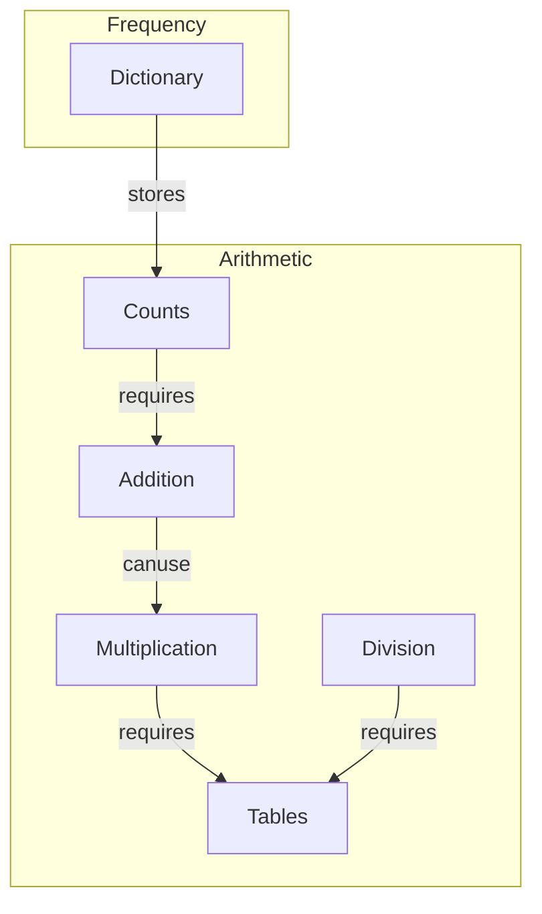

# Gauri's code repository

### What is the repository?
This repository contains code that can generate a table for any number.

   
| What you can do | Code |  Demonstration |
|---              |--                 |--- |
| Arithmetic operations | [code](st_addition.py) | [demo](https://gaurigauri-math1-st-calculator-simple-v8j7rd.streamlit.app/)|
| Frequency counting  | [code](st_letter_histogram.py)| [demo](https://gaurigauri-math1-st-letter-histogram-n57kn5.streamlit.app/)|

   
   
### How the code is structured?

   
   

