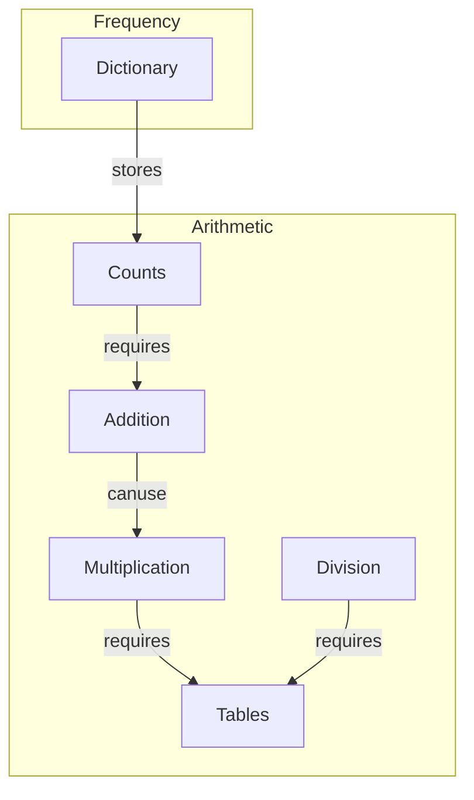

# math1

This repository contains code that can generate a table for any number.

| What you can do | Where is the code |
|---              |--                 |
| Addition        | [code](st_addition.py) |
| Multiplication  | st_multiplication.py|

